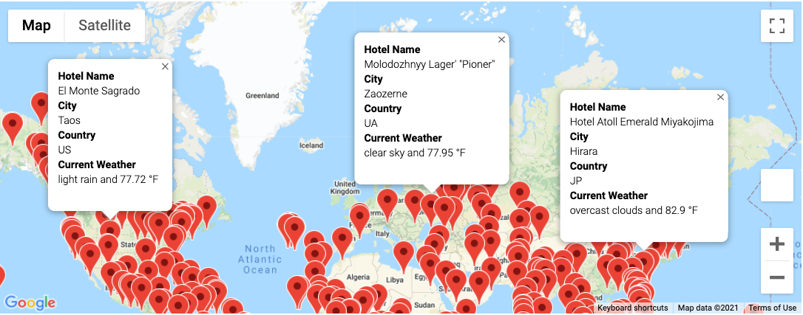
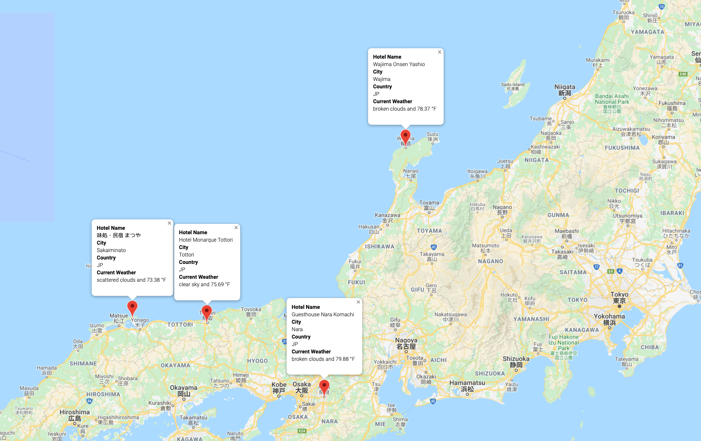

# World_Weather_Analysis
## Overview
Performing world weather analysis with APIs and creating Google maps for vacation planning.

## Retrieve Weather Data
### Retrieve weather data for 2000 random cities showing their coordinates, and current weather information.

## Create a Customer Travel Destinations Map
### Retrieve vacation destination data for customer based on the preferred max temperature:

### Create a marker layer map containing pop-up marker for each city:

## Create a Travel Itinerary Map
### Create a directions layer map between cities for travelers:

### Create a marker layer map containing pop-up markers for the cities on the itinerary:

